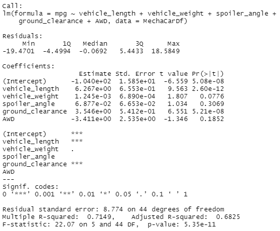
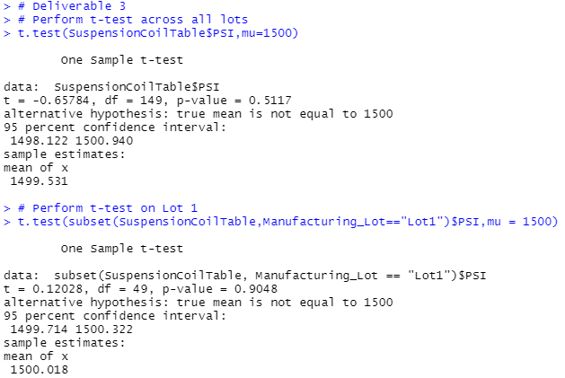
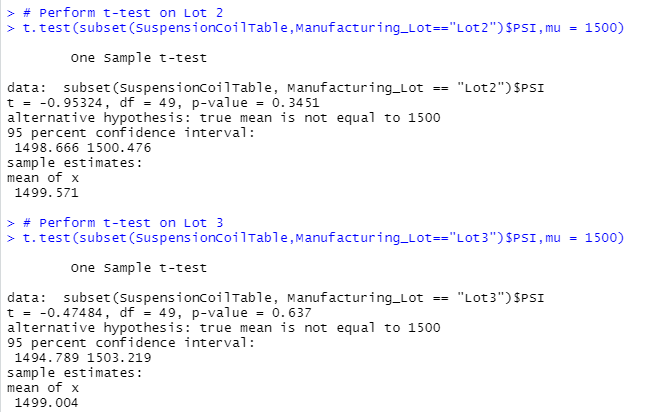

# MechaCar Statistical Analysis

## Purpose

The purpose of this project was to conduct a series of statistical analyses on data sets provided for a car manufacturing company, MechaCar. Additionally, a hypothetical description of an analysis that could be done to compare the ocmpany against other car manufacturers was detailed.

## Linear Regression to Predict MPG

Using the summary output above, we can answer the following questions regarding MPG of the MechaCar prototypes:

1. Which variables/coefficients provided a non-random amount of variance to the mpg values in the dataset?

    When looking at the linear regression output above, one can see that the variables that provided a non-random amount of variance to the mpg values in the dataset are the vehicle length and ground clearance. The Pr(>|t|) values for vehicle length and ground clearance are approximately 5.08e-08 and 5.21e-08 respectively. Additionally, since the Pr(>|t|) value for our intercept, mpg, is not significantly significant then it means that there are no variables that contribute to the variation in mpg efficiency.

2. Is the slope of the linear model considered to be zero? Why or why not?

    The slope for this linear model is not considered to be zero. This is easily identified by looking at our p-value of 5.35e-11, which is much smaller than the assumed significance level of 0.05%. Since the p-value is smaller than the significance level we can reject the null hypothesis which in turn means that the slope of our linear model is not zero.

3. Does this linear model predict mpg of MechaCar prototypes effectively? Why or why not?
    
    This linear model is able to predict the mpg of MechaCar prototypes quite effectively. Again looking at the summary output, the r-squared coefficient is ~0.71, meaning that we have a moderate level of strength in correlation between the data examined and its effects on mpg. In other words about 71% of the variance in the dependent variable, mpg, is explained by the other variables that we provided (vehicle length, vehicle weight, spoiler angle, ground clearance, and all wheel drive).

## Summary Statistics on Suspension Coils

Using the total_summary and lot_summary dataframes shown above, we can answer the following question:

1. The design specifications for the MechaCar suspension coils dictate that the variance of the suspension coils must not exceed 100 pounds per square inch. Does the current manufacturing data meet this design specification for all manufacturing lots in total and each lot individually? Why or why not?

    Based on the summary output, we can see that the MechaCar suspension coils do not exceed a variance of 100 PSI when grouping all lots as a total. The total_summay dataframe, includes all points in the population and as such shows that the population mean is roughly 1499.5 PSI. When we look at the PSI variance in this dataframe, we see that there is approximately a 76.2 PSI variance grouping all three lots together. However, when we look at the lots individually, it appears as though lot 3, has a PSI variance that is much greater than the specified 100 pounds per square inch. The disparity in these results stems from the fact that lots 1 and 2 have very small variances from that the PSI of the cars manufactured in these lots is very close to 1499.5 and are able to compensate for the very large variance of lot 3. Only by looking at manufacturing lots individually are we able to see that lot 3's variance is much larger than that of its counterparts (about 220 PSI) indicating poor manufacturing standards from that lot. In short, the data tells us that as a whole MechaCars does meet PSI design specs but when it is broken down by lots, only the vehicles manufactured in lots 1 and 2 reliably meet the specifications while lot 3 does not.

## T-Tests on Suspension Coils

### T-Tests Summary

In order to better understand our Suspension Coil data, t-tests were performed for all manufacturing lots and each lot indivudally to see whether the PSI of the cars manufactured in each is statistically different from the  population PSI mean of 1500 pounds per square inch. When looking at t-test metrics, it is the p-value that tells us whether or not the two means being compared are statistically similar. In the first t-test, which looked at all three lots and compared that to the population we can see that the p-value is above the 0.05 significance level meaning that the two means are statistically similar - combined, there is no statistical difference betwen all lots and the presumed PSI of 1500 pounds per square inch of the total population. This is also true for the other t-tests conducted for each individual lots with their p-values being as follows: Lot 1 = 0.90, Lot 2 = 0.34, and Lot 3 = 0.64. Furthermore, these results can also be seen in the means for each population as indicated by the "mean of x" metric under each t-test which shows that all lots manufacture cars with a PSI very close to 1500.

## Study Design: MechaCar vs Competition

In order for MechaCar to remain competitive as a car manufacturer, the company should conduct another analysis comparing the cars it makes against those made by the competition.

### Metrics

I believe that when considering buying a car, consumers prioritize the following metrics: 

- cost
- fuel efficiency
- safety rating
- maintenance cost
- depreciation cost

As such these are the metrics that I would include in an analysis comparing MechaCar to other car manufacturers.

### Hypotheses

In this analysis, the null and alternate hypothis would be as follows:

- The null hypothesis, H0, would indicate that the means of all groups are equal. In other words MechaCar, or another manufacturer, is not performing significantly better or worse than other manufacturers in the metric examined.

- The alternate hypothesis, HA, would indicate that at least one of the means is different from all other groups. In other words MechaCar, or another manufacturer, is performing significantly better or worse than other manufacturers in the metric examined.

### Statistical Test

I believe that the statistical test most appropriate for comparing these metrics would be one-way ANOVA tests measuring each metric for different cars based on the car manufacturers. Since the purpose of the analysis is to see how the means of the different metrics for the car manufacturers compare against one another it is the most efficient way of mesuring the differences. Multiple t-tests could be done but it would be very inefficient and leaves more room for error. Furthermore, the ANOVA tests show variation between and within the means of each manufacturer much easier.

### Data Needed

Perhaps the most important part of the analysis would be collecting the data needed to perform the statistical tests. In order to best compare the metrics mentioned, we would probably have to collect data from a third party source for each metric - this reduces data bias. It is important to note that for each metric we should use the same data source as this minimizes data variance. Because the ANOVA, aov(), function in R takes in two arguments - formula and data - the data collected could be structured in a dataframe similar to the one used for the Suspension Coil dataset. We would need columns for each metric ensuring that the data is numerical and continuous and would have to have a large population size for each metric to have a normal distribution. As far as specifics go on where and how to get all of the data, most manufacturers actually share most of the metrics such as fuel efficiency that we want to look at. If we wanted to have more qualitative data such as percieved safety rating by consumers, we could conduct a large poll where we record the metric on a scale to make it quantifiable.

In short, I believe that an analysis such as the one I have detailed above would be very beneficial to MechaCar as one-way ANOVA tests would show how MechaCar ranks against competitors and the industry in the metrics of cost, fuel efficiency, safety rating, maintenance cost, and depreciation cost.
